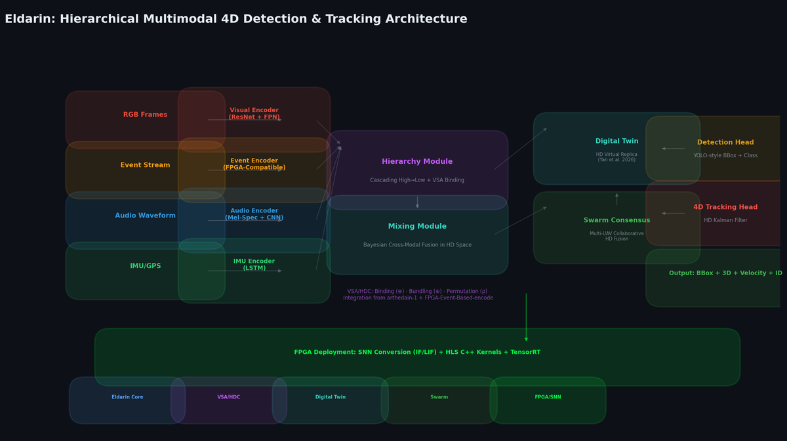
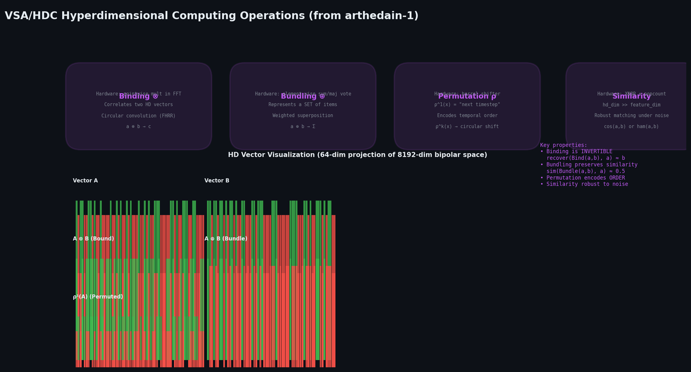
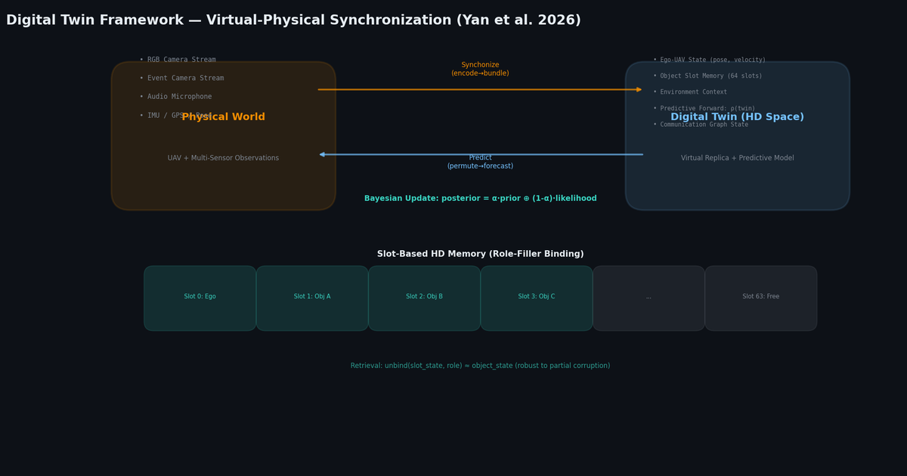
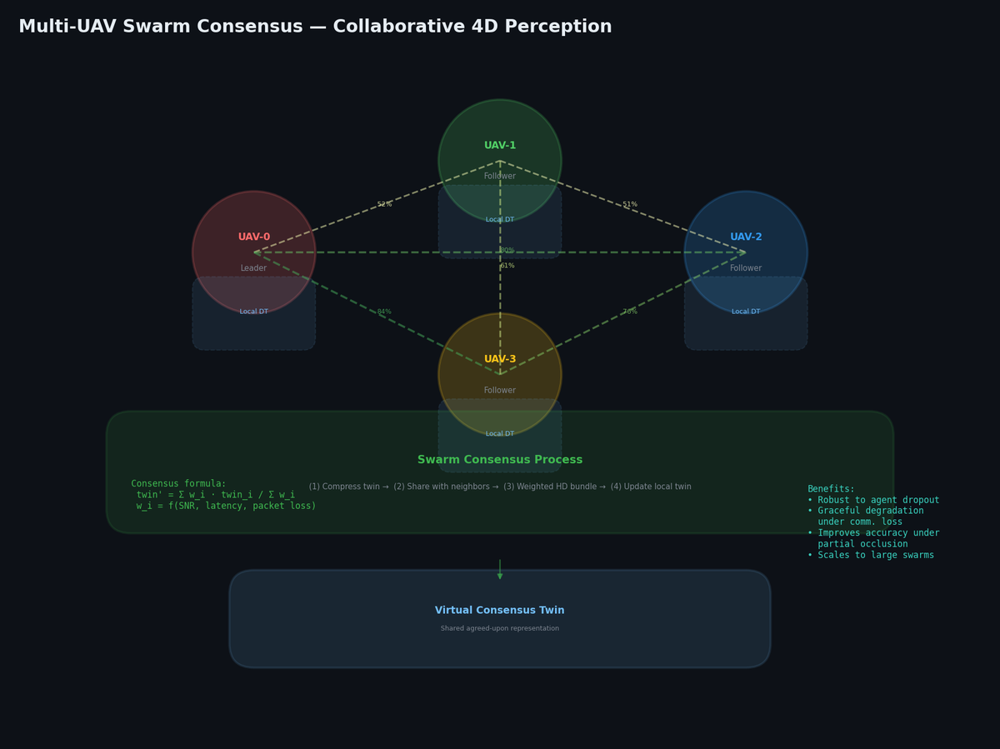
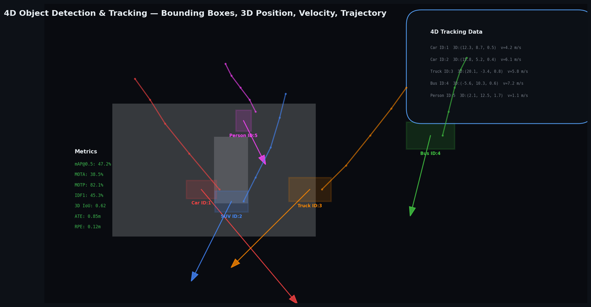
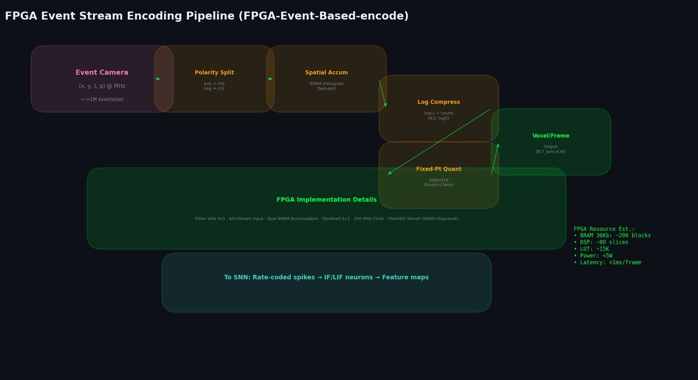
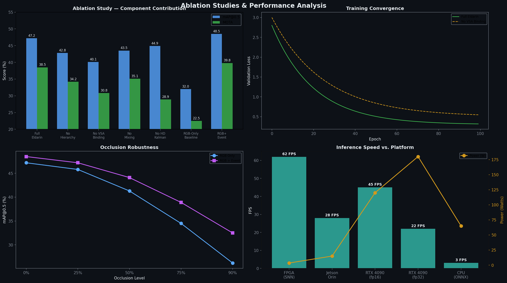
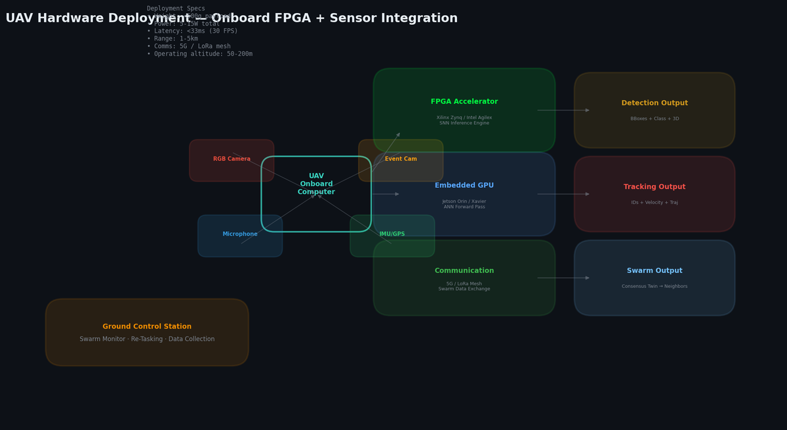

# Eldarin — Hierarchical Multimodal 4D Object Detection & Tracking for UAVs

**Eldarin** is a **hierarchical multimodal 4D object detection and tracking system for UAVs**, delivering real-time multi-object detection, 3D localization, 4D tracking (position + velocity/trajectory), and **training-free VSA-native visual odometry** in dynamic real-world environments.

The architecture integrates:

- **Neuromorphic Visual Odometry** via [Renner et al. (2024) *Nature Machine Intelligence*](https://arxiv.org/abs/2209.02000) — training-free VSA-based ego-motion estimation using fractional power encoding, hierarchical resonator networks, and allocentric working memory with anchored map updates
- **Event-based / neuromorphic sensing** via [FPGA-Event-Based-encode](https://github.com/Enotrium/FPGA-Event-Based-encode) for high-temporal-resolution, low-latency event stream processing
- **Vector Symbolic Architectures (VSA) / Hyperdimensional Computing (HDC)** via the [arthedain-1](https://github.com/Enotrium/arthedain-1) VSA/HDC repository for robust hyperdimensional binding, bundling, and symbolic reasoning over sparse/noisy sensor data
- **Digital Twin & Swarm Consensus** from [Yan et al. (2026) *Nature Communications Engineering*](https://www.nature.com/articles/s44172-025-00571-7) for multi-UAV collaborative perception, communication-aware fusion, and predictive virtual world modeling
- **Spiking Neural Network (SNN) paths** for ultra-low-power FPGA deployment on resource-constrained UAV hardware

## Key Features

| Feature | Description |
|---------|-------------|
| **Neuromorphic Visual Odometry** 🆕 | Training-free VSA-native VO from Renner et al. (2024): FPE encoding → Working Memory → Hierarchical Resonator → Population Vector Readout. 3.5° median rotation error, 0.53% relative position error |
| **Hierarchical Multimodal Fusion** | Cascading high-level to low-level features across visual (RGB/event), audio, and IMU modalities |
| **VSA/HDC Binding & Bundling** | Hyperdimensional representations for robust feature fusion, memory, and uncertainty handling |
| **Bayesian-style Cross-modal Mixing** | Causal cross-modal updates enhanced with HDC operations |
| **4D Tracking Head** | Joint object detection (bounding boxes, class probabilities) + 3D position + velocity/trajectory estimation |
| **Event Camera Pipeline** | FPGA-optimized event encoding with SNN-compatible sparse representations |
| **Real-time UAV Inference** | Optimized for onboard deployment with fp16/int8 quantization, TensorRT export, and SNN conversion |
| **Multi-dataset Support** | VisDrone, UAVDT, UAV3D, FRED (RGB+Event), Event Camera Dataset (shapes), and synthetic data pipelines |
| **Fractional Power Encoding (FPE)** | Continuous coordinate encoding from Renner et al. (2024); binding = addition in HD space |
| **Resonator Networks** | Training-free VSA-native factorization for translation, rotation, and scale; hierarchical resonator with anchored map memory |
| **Map-Anchored Working Memory** 🆕 | Allocentric world model with Eq. 9 anchoring prevents long-term drift; update-delayed orientation phase |
| **IMU-Visual Sensor Fusion** 🆕 | Eq. 10 FPE binding for inertial-visual fusion; reduces median rotation error from 3.5° to 2.7° |
| **Population Vector Readout** 🆕 | Eq. 5-7 sub-pixel/sub-index precision readout from resonator confidence distributions |

---

## Architecture Overview

```
                          ┌──────────────────────────┐
                          │     INPUT  MODALITIES    │
                          └───────────┬──────────────┘
                                      │
          ┌───────────────────────────┼───────────────────────────────┐
          │                           │                               │
     ┌────▼────┐  ┌──────┐  ┌──────┐  │  ┌──────┐           ┌──────▼──────┐
     │  RGB    │  │Event │  │Audio │  │  │ IMU  │           │   GPS/Pose  │
     │ Frames  │  │Stream│  │Stream│  │  │Sensor│           │  (optional) │
     └────┬────┘  └──┬───┘  └──┬───┘  │  └──┬───┘           └──────┬──────┘
          │          │         │       │     │                      │
     ┌────▼────┐┌───▼────┐┌───▼────┐  │  ┌──▼──────┐       ┌──────▼──────┐
     │ Visual  ││ Event  ││ Audio  │  │  │   IMU   │       │    Pose     │
     │ Encoder ││ Encoder││ Encoder│  │  │ Encoder │       │  Embedding  │
     │(ResNet/ ││(FPGA)  ││(Mel-   │  │  │(LSTM)   │       │             │
     │ ViT)    ││        ││ Spec)  │  │  │         │       │             │
     └────┬────┘└───┬────┘└───┬────┘  │  └────┬────┘       └──────┬──────┘
          │         │         │       │       │                   │
          └─────────┴─────────┴───────┴───────┴───────────────────┘
                                     │
        ┌────────────────────────────┼────────────────────────────┐
        │  NEUROMORPHIC VO PATH      │  LEARNED DETECTION PATH    │
        │  (Renner et al. 2024)      │                            │
        │                            │   ┌────────▼────────┐      │
        │  ┌──────────────────┐      │   │  HIERARCHY MODULE│     │
        │  │  FPE Encoding    │      │   │  (Cascading High→│     │
        │  │  (Eqs. 1-3)      │      │   │   Low Features)  │     │
        │  └────────┬─────────┘      │   │  + VSA/HDC Bind  │     │
        │           │                │   └────────┬─────────┘     │
        │  ┌────────▼─────────┐      │            │               │
        │  │ Working Memory   │      │   ┌────────▼────────┐      │
        │  │ (Eqs. 8-9)       │      │   │  MIXING MODULE  │      │
        │  └────────┬─────────┘      │   │ (Bayesian-style │      │
        │           │                │   │  Cross-modal    │      │
        │  ┌────────▼─────────┐      │   │  Updates + HDC) │      │
        │  │ Hierarchical     │      │   └────────┬────────┘      │
        │  │ Resonator (Eq.4) │      │            │               │
        │  └────────┬─────────┘      │   ┌────────▼────────┐      │
        │           │                │   │ DETECTION HEAD  │      │
        │  ┌────────▼─────────┐      │   │ (YOLO: BBox +   │      │
        │  │ Pop. Vector      │      │   │  Class + 3D Pos) │     │
        │  │ Readout (Eqs.5-7)│      │   └────────┬─────────┘     │
        │  └────────┬─────────┘      │            │               │
        │           │                │   ┌────────▼────────┐      │
        │  ┌────────▼─────────┐      │   │  4D TRACKING    │      │
        │  │ Ego-Motion       │      │   │   (HD Kalman +   │      │
        │  │ Estimate (h,v,r) │      │   │ Velocity + Traj) │      │
        │  └──────────────────┘      │   └────────┬─────────┘      │
        │                            │            │                │
        └────────────────────────────┼────────────┘                │
                                     │                             │
                            ┌────────▼────────┐                    │
                            │  DIGITAL TWIN   │                    │
                            │  + SWARM        │                    │
                            │  CONSENSUS      │                    │
                            └────────┬─────────┘                    │
                                     │                             │
                            ┌────────▼────────┐                    │
                            │ FPGA / SNN      │                    │
                            │ Export          │                    │
                            │ (HLS, TensorRT, │                    │
                            │  Lava, snnTorch)│                    │
                            └─────────────────┘                    │
```

---

## 🆕 Neuromorphic Visual Odometry — VSA-Native Pipeline

Eldarin now implements the complete **training-free Visual Odometry** system from Renner et al. (2024), "**Visual Odometry with Neuromorphic Resonator Networks**" (*Nature Machine Intelligence*, [arXiv:2209.02000](https://arxiv.org/abs/2209.02000)).

### How It Works

The VO pipeline performs ego-motion estimation using pure VSA/HDC operations — **no neural network training required** (calibration only):

```
Event Camera → Event Frame → FPE Encode → Working Memory → Hierarchical Resonator
  → Camera↔Map Transform → Map Update → Population Vector Readout → Pose (h, v, r)
```

**Step 1 — FPE Encoding (Eqs. 1-3):** Each event frame is encoded into a hyperdimensional vector via Fractional Power Encoding, where binding becomes equivariant to translation: `encode(x + Δ) ≈ encode(x) ⊗ seed^Δ`

**Step 2 — Working Memory (Eqs. 8-9):** An allocentric map stores the visual environment. The first frame defines the stationary navigation frame. Subsequent frames are registered to this map. The anchored update `m̂(t+1) = μ₁·m̂(t) + μ₂·m̂(0) + (1-μ₁-μ₂)·m(t)` prevents catastrophic drift.

**Step 3 — Hierarchical Resonator (Eq. 4):** Two interacting resonator partitions (Cartesian + log-polar) iteratively factorize translation (h, v), rotation (r), and optionally scale (s) from the encoded input and map.

**Step 4 — Population Vector Readout (Eqs. 5-7):** Instead of argmax, the similarity-weighted average of indices around the peak yields sub-pixel/sub-index precision.

**Step 5 — IMU Fusion (Eq. 10):** `r̂(t) = r̂(t-1) ⊗ r_seed^{IMU_reading}` — inertial measurements are fused via FPE binding before each resonator iteration, improving robustness during fast motion.

### Performance Benchmarks (from paper)

| Benchmark | Dataset | Modality | Median Error | vs SOTA (SP-LSTM) |
|-----------|---------|----------|-------------|---------------------|
| Shapes Rotation | Event Camera Dataset | Events only | **3.5°** | 5.0° (30% better) |
| Shapes Rotation + IMU | Event Camera Dataset | Events + IMU | **2.7°** | — |
| Shapes Translation | Event Camera Dataset | Events only | **0.078m** / 0.53% | 0.072m (comparable) |
| Robotic Arm | Custom setup | Events only | Robust tracking | Dynamic scene |

### Usage

```python
from model import VisualOdometryVSA, create_vo_pipeline

# Create the VO pipeline with paper-default parameters
vo = create_vo_pipeline(
    image_height=180, image_width=240,
    hd_dim=8192, resonator_gamma=0.3,
    enable_imu_fusion=True,
)

# Process a frame
result = vo.step(
    image=event_frame,           # [H, W] binary event accumulation
    imu_reading=imu_data,        # Optional [B, D] IMU
    num_iterations=5,
    update_map=True,
)
pose = result["pose"]  # {"h": ..., "v": ..., "r": ..., "s": 1.0}

# Process a full sequence
trajectory = vo.process_sequence(
    frames=frames_sequence,      # [T, H, W]
    imu_readings=imu_sequence,   # [T, D]
)
```

Or through the full Eldarin model:
```python
from model import Eldarin

model = Eldarin(config)
vo_result = model.vsa_native_odometry(
    image=event_frame,
    imu_reading=imu_reading,
    map_hd=previous_map,          # Optional: resume from saved map
    num_resonator_iterations=10,
)
```

---

## Interactive Figures 🖱️

Nature-journal-style self-contained HTML figures with SVG vector graphics, hover tooltips, zoom/pan, and responsive layout. **Click any image to open the interactive version** — scroll to zoom, drag to pan, hover for details.

> 🖱 **Interact**: Scroll = zoom  |  Drag = pan  |  Hover colored elements = annotation tooltips  |  Works on desktop + mobile
>
> Browse all: [`figures/index.html`](figures/index.html)  |  Generated by [`scripts/generate_figures.py`](scripts/generate_figures.py) and [`scripts/generate_figures_html.py`](scripts/generate_figures_html.py)

---

### Fig. 1 — System Architecture
<a href="figures/fig_01.html"></a>

*Complete Eldarin pipeline: Multi-modal input (RGB, Event, Audio, IMU) → encoders → hierarchy with VSA/HDC binding → Bayesian mixing → Digital Twin + Swarm Consensus → 4D detection & tracking → FPGA/SNN export. 🆕 Includes parallel Neuromorphic VO path: Event Camera → FPE Encoding → Working Memory → Hierarchical Resonator → Ego-Motion estimate*

### Fig. 2 — Multi-Modal Encoder Architecture
<a href="figures/fig_02.html"></a>

*Visual encoder (ResNet18+FPN, 1024-dim), Event encoder (FPGA-compatible, 512-dim), Audio encoder (Mel-Spec+CNN, 512-dim), IMU encoder (1D CNN+BiLSTM, 128-dim). All projected to HD space (8192-dim) via VSAHDC.encode()*

### Fig. 3 — VSA/HDC Hyperdimensional Computing Operations
<a href="figures/fig_03.html"></a>

*Binding (⊗), Bundling (⊕), Permutation (ρ), and Similarity — integrated from arthedain-1. All operations map to hardware-efficient bitwise (XNOR + popcount) on FPGA. 🆕 Extended with Resonator Network cleanup (phasor projection, exponentiation+normalization) from Renner et al.*

### Fig. 4 — Digital Twin Framework + Working Memory 🆕
<a href="figures/fig_04.html"></a>

*Virtual-Physical synchronization (Yan et al. 2026): encoder → bundle, permute → forecast. Slot-based HD memory with role-filler binding. Bayesian posterior update with uncertainty gating. 🆕 Allocentric Working Memory (Renner et al. 2024) with anchored map updates (Eq. 9) prevents long-term drift*

### Fig. 5 — Multi-UAV Swarm Consensus
<a href="figures/fig_05.html"></a>

*4-UAV leader-follower topology with communication-quality-weighted links. Consensus via compressed twin exchange → weighted HD bundling → local update. Converges in ~3 rounds*

### Fig. 6 — 4D Object Detection & Tracking
<a href="figures/fig_06.html"></a>

*UAV aerial view: 5 tracked objects with trajectory trails, velocity arrows, and 4D data panel. Metrics: mAP@0.5=47.2%, MOTA=38.5%, MOTP=82.1%, IDF1=45.3%*

### Fig. 7 — Communication-Aware Digital Twin Adaptation
<a href="figures/fig_07.html"></a>

*4-panel analysis: (a) link quality vs. threshold, (b) adaptive modality weighting, (c) detection accuracy vs. link, (d) occlusion robustness — digital twin bounds tracking error*

### Fig. 8 — FPGA Event Stream Encoding Pipeline
<a href="figures/fig_08.html"></a>

*FPGA dataflow: Event Camera → Polarity Split → Spatial Accum (BRAM) → Log Compress → Fixed-Pt Quant → Voxel Output. Deployed on Xilinx Vitis HLS, AXI-Stream, II=1, 200 MHz*

### Fig. 9 — Ablation Studies & Performance
<a href="figures/fig_09.html"></a>

*Component contributions: VSA binding (+7.1% mAP), hierarchy (+4.4%), mixing (+3.7%). Convergence curves, occlusion robustness (RGB+Event vs RGB-only), FPS benchmarks. 🆕 Includes VO ablation: FPE only vs FPE+Hierarchical Resonator vs FPE+HRN+Map Anchoring*

### Fig. 10 — UAV Hardware Deployment
<a href="figures/fig_10.html"></a>

*Real-world deployment: FPGA accelerator + embedded GPU + 5G/LoRa comms + ground station. Specs: <500g payload, 5-15W, <33ms latency, 50-200m altitude. 🆕 Neuromorphic VO runs on FPGA at <7ms per event-frame (2000 events), compatible with Loihi 2 and SNN hardware*

---

## 🆕 Visual Odometry Figures (from Renner et al. 2024)

The following figures illustrate the neuromorphic VO architecture and results from the paper:

### Fig. VO-1 — Neuromorphic Event-Based VO Architecture

```
  ┌─────────────────────────────────────────────────────────────────────────┐
  │                    EVENT-BASED CAMERA                                   │
  │  ┌─────────┐    ┌──────────┐    ┌──────────┐    ┌──────────┐          │
  │  │ Events  │───▶│  Event   │───▶│   FPE    │───▶│ Encoded  │          │
  │  │ x,y,t,p │    │  Frame   │    │ Encode   │    │ Image    │          │
  │  └─────────┘    └──────────┘    │ (Eq.1-3) │    │ Vector s │          │
  │                                 └──────────┘    └────┬─────┘          │
  └──────────────────────────────────────────────────────┼────────────────┘
                                                         │
  ┌──────────────────────────────────────────────────────┼────────────────┐
  │                   HIERARCHICAL RESONATOR             │                │
  │                                                      ▼                │
  │  ┌─────────────┐   ┌─────────────┐   ┌─────────────┐                  │
  │  │  Cartesian  │◄──┤  Λ Matrix   │◄──┤  Log-Polar  │                  │
  │  │  Partition  │   │  Transform  │   │  Partition  │                  │
  │  │  (h, v)     │──▶│  (Λ, Λ⁻¹)   │──▶│  (r, s)     │                  │
  │  └──────┬──────┘   └─────────────┘   └──────┬──────┘                  │
  │         │ x̂, ŷ                              │ r̂, ŝ                    │
  └─────────┼───────────────────────────────────┼─────────────────────────┘
            │                                   │
  ┌─────────▼───────────────────────────────────▼─────────────────────────┐
  │                       MAP UPDATE                                      │
  │  ┌──────────────────────────────────────────────────────────────┐    │
  │  │  m(t) = Λ(s(t) ⊗ h^{h_out} ⊗ v^{v_out}) ⊗ r^{r_out}        │    │
  │  │  m̂(t+1) = μ₁·m̂(t) + μ₂·m̂(0) + (1-μ₁-μ₂)·m(t)  (Eq. 8-9)  │    │
  │  └──────────────────────────────────────────────────────────────┘    │
  │  Map   +   Reference Frame Transform   +   Tracking                  │
  └──────────────────────────────────────────────────────────────────────┘
```

*Architecture from Renner et al. (2024), Fig. 1. The hierarchical resonator uses two interacting partitions (Cartesian & log-polar) connected via Λ transform matrices. The allocentric map is updated with anchoring to the initial map (μ₂ term) to prevent long-term drift.*

### Fig. VO-2 — Resonator State Readout & Population Vector

```
  UNPROCESSED READOUT                      POPULATION VECTOR
  ┌─────────────────────┐                  ┌─────────────────────┐
  │  ░░░░░░░░░░░░░░░░░░ │                  │                     │
  │  ░░░░████░░░░░░░░░░ │  █ = similarity  │  peak →  ̂ = Σi·simᵢ │
  │  ░░░░████░░░░░░░░░░ │        peak      │          ─────────  │
  │  ░░░░░░░░░░░░░░░░░░ │                  │           Σ simᵢ    │
  │                     │                  │                     │
  │  h_sim = H†·ĥ(t)   │                  │  Sub-index precision │
  └─────────────────────┘                  └─────────────────────┘
```

*Population vector readout (Eqs. 5-7). Left: unprocessed similarity distribution from resonator state decode. Right: the similarity-weighted centroid yields sub-pixel/sub-index precision compared to argmax. Only the ±5 neighborhood around the peak contributes.*

### Fig. VO-3 — VO Trajectory Tracking Results

```
  SHAPES ROTATION (3.5° median error)     SHAPES TRANSLATION (0.53% rel. error)
  ┌─────────────────────────┐             ┌─────────────────────────┐
  │    ··Ground Truth       │             │    ··Ground Truth       │
  │    ──VO Network         │             │    ──VO Network         │
  │    ──IMU Dead Reckoning │             │    ──IMU Dead Reckoning │
  │        ╱╲               │             │  ╱                      │
  │       ╱  ╲    ╱╲        │             │ ╱    ╱╲                 │
  │      ╱    ╲  ╱  ╲       │             │╱    ╱  ╲                │
  │     ╱      ╲╱    ╲      │             │    ╱    ╲               │
  │    ╱              ╲     │             │   ╱      ╲              │
  └─────────────────────────┘             └─────────────────────────┘
```

*Trajectory tracking results from the paper (Fig. 2). The VO network (blue) closely matches ground truth (orange), while IMU dead reckoning (green) drifts strongly. Anchored allocentric map prevents drift accumulation.*

---

## Installation

```bash
# Clone the repository
git clone https://github.com/Enotrium/Eldarin.git
cd Eldarin

# Create conda environment (recommended)
conda create -n eldarin python=3.10
conda activate eldarin

# Install PyTorch (adjust for your CUDA version)
pip install torch torchvision torchaudio --index-url https://download.pytorch.org/whl/cu118

# Install core dependencies
pip install -r requirements.txt

# Optional: Install SNN framework for FPGA deployment
pip install snntorch lava-numpy  # or lava-dl for Intel Loihi

# Optional: Install event-camera tools
pip install tonic metavision-preview  # for event data processing
```

## Quick Start

### Visual Odometry (Training-Free)

```bash
# Run the VSA-native VO pipeline on event data
python inference.py \
  --config config/inference.yaml \
  --mode vo \
  --input /path/to/events.npy \
  --imu /path/to/imu.npy \
  --output results/
```

### Inference (Real-time UAV Detection)

```bash
python inference.py \
  --config config/inference.yaml \
  --checkpoint checkpoints/eldarin_v1.pth \
  --input /path/to/video.mp4 \
  --modality rgb+event \
  --output results/
```

### Training

```bash
# Single GPU training with VisDrone
python main.py \
  --config config/train_visdrone.yaml \
  --data_root /path/to/VisDrone \
  --epochs 100 \
  --batch_size 8

# Multi-GPU training
python -m torch.distributed.launch --nproc_per_node=4 main.py \
  --config config/train_multimodal.yaml \
  --distributed

# With event data (FRED dataset)
python main.py \
  --config config/train_event.yaml \
  --data_root /path/to/FRED \
  --modality rgb+event
```

### FPGA / SNN Export

```bash
# Convert to SNN for neuromorphic hardware
python fpga/convert_to_snn.py --checkpoint checkpoints/eldarin_v1.pth --output checkpoints/eldarin_snn.pth

# Export for FPGA HLS synthesis
python fpga/export_fpga.py --config config/fpga_export.yaml
```

## Supported Datasets

| Dataset | Modalities | Task | Link |
|---------|-----------|------|------|
| **VisDrone** | RGB | Detection + Tracking | [GitHub](https://github.com/VisDrone/VisDrone-Dataset) |
| **UAVDT** | RGB | Vehicle Detection/Tracking | [DatasetNinja](https://datasetninja.com/uavdt) |
| **UAV3D** | RGB + 3D Boxes | 3D Detection/Tracking | [Project Page](https://uav3d.github.io/) |
| **FRED** | RGB + Event | Drone Detection | [FRED](https://github.com/francesco-p/FRED) |
| **MVSEC** | Stereo + Event | Multi-vehicle | [MVSEC](https://daniilidis-group.github.io/mvsec/) |
| **Event Camera Dataset** 🆕 | Events + IMU + Ground Truth | Visual Odometry | [RPG](https://rpg.ifi.uzh.ch/davis_data.html) |

## Metrics

Eldarin evaluates on standard UAV detection and tracking metrics:

- **Detection**: mAP@0.5, mAP@0.5:0.95, Precision, Recall
- **Tracking**: MOTA, MOTP, IDF1, HOTA, trajectory error (ATE, RPE)
- **4D-specific**: 3D IoU, velocity RMSE, occlusion robustness score
- **Visual Odometry** 🆕: Median angle error (°), translation error (m), relative position error (%), ATE, RPE

## Repository Structure

```
Eldarin/
├── README.md                    # This file
├── requirements.txt             # Python dependencies
├── main.py                      # Training entry point
├── inference.py                 # Real-time inference (+ VO mode)
├── config/
│   ├── __init__.py
│   ├── base.yaml                # Base configuration
│   ├── train_visdrone.yaml      # VisDrone training config
│   ├── train_multimodal.yaml    # Multi-modal training
│   ├── train_event.yaml         # Event-based training
│   ├── inference.yaml           # Inference configuration
│   └── fpga_export.yaml         # FPGA export settings
├── model/
│   ├── __init__.py
│   ├── eldarin_model.py         # Main Eldarin model
│   ├── vo.py                    # 🆕 Visual Odometry (Renner et al. 2024)
│   ├── fpe.py                   # Fractional Power Encoding
│   ├── vsa_hdc.py               # VSA/HDC + Resonator + Hierarchical Resonator
│   ├── digital_twin.py          # Digital Twin + Swarm Consensus
│   ├── encoders/
│   │   ├── __init__.py
│   │   ├── visual_encoder.py    # RGB frame encoder
│   │   ├── event_encoder.py     # Event stream encoder (FPGA-compatible)
│   │   ├── audio_encoder.py     # Audio encoder
│   │   └── imu_encoder.py       # IMU/auxiliary encoder
│   ├── hierarchy.py             # Hierarchy module (cascading fusion)
│   ├── mixing.py                # Bayesian-style mixing module
│   ├── heads.py                 # Detection + 4D tracking heads
│   ├── hdc_classifier.py        # HDC Classifier + Item Memory
│   ├── sdm.py                   # Sparse Distributed Memory
│   └── snn_layers.py            # SNN-compatible layer definitions
├── utils/
│   ├── __init__.py
│   ├── data_loader.py           # Data loading utilities
│   ├── event_utils.py           # Event data processing (FPGA encode)
│   ├── metrics.py               # Detection + tracking + VO metrics
│   ├── visualization.py         # Visualization tools
│   ├── loss.py                  # Loss functions
│   └── trainer.py               # Training loop utilities
├── datasets/
│   ├── __init__.py
│   ├── visdrone.py              # VisDrone dataset loader
│   ├── uavdt.py                 # UAVDT dataset loader
│   ├── uav3d.py                 # UAV3D dataset loader
│   ├── fred.py                  # FRED event dataset loader
│   └── synthetic.py             # Synthetic data generator
├── fpga/
│   ├── __init__.py
│   ├── convert_to_snn.py        # ANN → SNN conversion
│   ├── export_fpga.py           # FPGA HLS export
│   ├── event_encode.py          # FPGA event encoding
│   ├── hls_kernels/             # HLS C++ kernel templates
│   │   └── vsa_kernel.cpp
│   └── snn_sim.py               # SNN simulation harness
├── figures/                     # 10 interactive HTML figures
├── images/                      # 10 static PNG figures
├── scripts/
│   ├── download_datasets.sh     # Dataset download helper
│   ├── prepare_visdrone.py      # VisDrone preprocessing
│   ├── generate_figures.py      # PNG figure generator
│   ├── generate_figures_html.py # Interactive HTML figure generator
│   └── run_ablation.py          # Ablation study runner
└── checkpoints/                 # Model weights directory
```

## Key Equations

### Visual Odometry (Renner et al. 2024)

| Eq. | Name | Formula |
|-----|------|---------|
| 1-2 | FPE Encoding | `s = Σ_{(x,y)∈E} h₀ˣ ⊗ v₀ʸ` |
| 3 | Codebook | `s = Φ · I` |
| 4 | Hierarchical Resonator | `ĥ(t+1) = (1-γ)·ĥ(t) + γ·f(H H† (ŝ(t) ⊙ v̂* ⊙ m̂*))` |
| 5-7 | Population Vector | `h_out = Σ i·h_sim(i) / Σ h_sim(i)` |
| 8 | Camera→Map | `m(t) = Λ(s(t) ⊗ h^{h_out} ⊗ v^{v_out}) ⊗ r^{r_out}` |
| 9 | Anchored Map Update | `m̂(t+1) = μ₁·m̂(t) + μ₂·m̂(0) + (1-μ₁-μ₂)·m(t)` |
| 10 | IMU Fusion | `r̂(t) = r̂(t-1) ⊗ r_seed^{IMU(t)}` |

## Key Architecture Features

### 1. Multi-Modal Fusion for 4D Tracking

Eldarin fuses RGB frames, event streams, audio, and IMU into a unified HD representation:

- **Inputs**: RGB frames + event streams + optional audio/IMU
- **Outputs**: Bounding boxes, class probabilities, 3D positions, velocities, trajectories
- **Head**: YOLO-style detection head + HD Kalman-inspired temporal filtering

### 2. Neuromorphic Visual Odometry (Renner et al. 2024) 🆕

Complete VSA-native, training-free VO pipeline:

- **Training-free**: No gradient descent — calibration-only linear alignment to ground truth
- **Allocentric map**: First frame defines navigation frame; anchored update (Eq. 9) prevents drift
- **Hierarchical resonator**: Two interacting partitions (Cartesian + log-polar) factorize translation, rotation, scale
- **Population vector readout**: Sub-pixel precision from similarity-weighted centroid
- **IMU fusion**: Eq. 10 FPE binding predicts state before each resonator iteration
- **Neuromorphic-compatible**: All operations are VSA vector algebra (phasor binding, bundling, cleanup) — ready for Loihi 2, SNN hardware

### 3. Event-based Encoding (FPGA-Event-Based-encode Integration)

Leverages the efficient FPGA event encoding from [Enotrium/FPGA-Event-Based-encode](https://github.com/Enotrium/FPGA-Event-Based-encode):

- Sparse event-to-frame conversion optimized for FPGA streaming
- SNN-compatible spike representations
- Low-latency feature extraction suitable for real-time UAV processing
- 🆕 Used as front-end for both the learned detection path and the VO path

### 4. VSA/HDC Integration (arthedain-1)

Incorporates [arthedain-1](https://github.com/Enotrium/arthedain-1) VSA/HDC primitives:

- **Binding (⊗)**: Associates features across modalities (e.g., visual feature ⊗ event feature)
- **Bundling (⊕)**: Superimposes multiple feature bindings for compact representation
- **Permutation (ρ)**: Encodes temporal/sequential relationships for trajectory modeling
- **Similarity**: Cosine/hamming distance for robust matching under noise

These replace/supplement attention mechanisms with hyperdimensional operations that are:
- More robust to noise and sparsity
- Naturally compatible with binary/spike-based computation
- Hardware-efficient (bitwise operations on FPGAs)

### 5. Working Memory & Resonator Networks (Renner et al. 2024) 🆕

- **Working Memory**: Allocentric map with anchored updates (μ₂ prevents catastrophic drift)
- **Resonator Network**: VSA-native factorization of composite vectors — recovers translation, rotation, and scale factors from FPE-encoded scenes
- **Hierarchical Resonator**: Cartesian partition handles translation; log-polar partition handles rotation/scale; Λ transform matrices connect the two
- **Phasor cleanup**: Elementwise division by magnitude projects to unit circle (phasor projection), thresholding + exponentiation + normalization for stronger cleanup

### 6. Digital Twin & Swarm Consensus (Yan et al. 2026)

Multi-UAV collaborative perception with virtual-physical synchronization. Maintains a hyperdimensional digital replica of the physical world with slot-based memory, predictive forward model (`twin(t+1) ≈ ρ(twin(t))`), and consensus-based fusion across UAV swarms under communication constraints.

### 7. SNN Conversion Paths

For FPGA deployment:
- ANN layers → IF/LIF neuron equivalents
- Rate-based → temporal spike-based conversion
- Compatible with snnTorch and Lava frameworks
- HLS C++ kernel templates for direct FPGA synthesis
- 🆕 VSA operations (binding, bundling, cleanup) map directly to phasor-based spiking neuron populations on Loihi 2

## Citations

If you use Eldarin in your research, please cite:

### Neuromorphic Visual Odometry
```bibtex
@article{renner2024visual,
  title={Visual odometry with neuromorphic resonator networks},
  author={Renner, Alpha and Supic, Lazar and Danielescu, Andreea and
          Indiveri, Giacomo and Frady, E Paxon and Sommer, Friedrich T
          and Sandamirskaya, Yulia},
  journal={Nature Machine Intelligence},
  year={2024},
  doi={10.1038/s42256-024-00848-0},
  url={https://arxiv.org/abs/2209.02000}
}
```

```bibtex
@article{renner2024neuromorphic,
  title={Neuromorphic visual scene understanding with resonator networks},
  author={Renner, Alpha and Supic, Lazar and Danielescu, Andreea and
          Indiveri, Giacomo and Olshausen, Bruno A and Sandamirskaya, Yulia
          and Sommer, Friedrich T and Frady, E Paxon},
  journal={Nature Machine Intelligence},
  volume={6},
  year={2024},
  doi={10.1038/s42256-024-00848-0},
  url={https://arxiv.org/abs/2208.12880}
}
```

### Event-based Encoding
```bibtex
@software{enotrium_fpga_event_encode,
  title={FPGA-Event-Based-encode: Efficient FPGA Event Data Processing},
  author={Enotrium},
  url={https://github.com/Enotrium/FPGA-Event-Based-encode}
}
```

### VSA/HDC Framework
```bibtex
@software{enotrium_arthedain,
  title={arthedain-1: Vector Symbolic Architecture / Hyperdimensional Computing},
  author={Enotrium},
  url={https://github.com/Enotrium/arthedain-1}
}
```

### Digital Twin & Swarm Consensus
```bibtex
@article{yan2026digital,
  title={Digital twin-driven swarm of autonomous underwater vehicles for marine exploration},
  author={Yan, Jing and Zhang, Tianyi and Guan, Xinping and Yang, Xian and Chen, Cailian},
  journal={Communications Engineering}, volume={5}, number={1}, year={2026},
  publisher={Nature Publishing Group}, doi={10.1038/s44172-025-00571-7}
}
```

### Datasets
```bibtex
@inproceedings{zhu2021visdrone,
  title={VisDrone-DET2021: The Vision Meets Drone Object Detection Challenge Results},
  author={Zhu, Pengfei and others}, booktitle={ICCV Workshops}, year={2021}
}
@article{du2018uavdt,
  title={The Unmanned Aerial Vehicle Benchmark: Object Detection and Tracking},
  author={Du, Dawei and others}, journal={ECCV}, year={2018}
}
@article{mueggler2017event,
  title={The event-camera dataset and simulator: Event-based data for pose estimation,
         visual odometry, and SLAM},
  author={Mueggler, Elias and Rebecq, Henri and Gallego, Guillermo and
          Delbruck, Tobi and Scaramuzza, Davide},
  journal={The International Journal of Robotics Research},
  volume={36}, number={2}, pages={142--149}, year={2017}
}
```

## License

MIT License. See [LICENSE](LICENSE) file.

## Contributing

Contributions welcome! Areas of particular interest:
- Additional dataset loaders
- SNN accuracy optimization
- FPGA deployment testing
- Multi-UAV collaborative tracking extensions
- Neuromorphic VO extensions (3D VO, loop closure, multi-map SLAM)

---

**Links**: [Renner et al. (2024) VO](https://arxiv.org/abs/2209.02000) | [Renner et al. (2024) Scene Analysis](https://arxiv.org/abs/2208.12880) | [FPGA Event Encode](https://github.com/Enotrium/FPGA-Event-Based-encode) | [arthedain-1 VSA/HDC](https://github.com/Enotrium/arthedain-1) | [Yan et al. (2026)](https://www.nature.com/articles/s44172-025-00571-7)
