# Eldarin — Hierarchical Multimodal 4D Object Detection & Tracking for UAVs

**Eldarin** is a **hierarchical multimodal 4D object detection and tracking system for UAVs**, delivering real-time multi-object detection, 3D localization, and 4D tracking (position + velocity/trajectory) in dynamic real-world environments.

The architecture integrates:

- **Event-based / neuromorphic sensing** via [FPGA-Event-Based-encode](https://github.com/Enotrium/FPGA-Event-Based-encode) for high-temporal-resolution, low-latency event stream processing
- **Vector Symbolic Architectures (VSA) / Hyperdimensional Computing (HDC)** via the [arthedain-1](https://github.com/Enotrium/arthedain-1) VSA/HDC repository for robust hyperdimensional binding, bundling, and symbolic reasoning over sparse/noisy sensor data
- **Digital Twin & Swarm Consensus** from [Yan et al. (2026) *Nature Communications Engineering*](https://www.nature.com/articles/s44172-025-00571-7) for multi-UAV collaborative perception, communication-aware fusion, and predictive virtual world modeling
- **Spiking Neural Network (SNN) paths** for ultra-low-power FPGA deployment on resource-constrained UAV hardware

## Key Features

| Feature | Description |
|---------|-------------|
| **Hierarchical Multimodal Fusion** | Cascading high-level to low-level features across visual (RGB/event), audio, and IMU modalities |
| **VSA/HDC Binding & Bundling** | Hyperdimensional representations for robust feature fusion, memory, and uncertainty handling |
| **Bayesian-style Cross-modal Mixing** | Causal cross-modal updates enhanced with HDC operations |
| **4D Tracking Head** | Joint object detection (bounding boxes, class probabilities) + 3D position + velocity/trajectory estimation |
| **Event Camera Pipeline** | FPGA-optimized event encoding with SNN-compatible sparse representations |
| **Real-time UAV Inference** | Optimized for onboard deployment with fp16/int8 quantization, TensorRT export, and SNN conversion |
| **Multi-dataset Support** | VisDrone, UAVDT, UAV3D, FRED (RGB+Event), and synthetic data pipelines |

## Architecture Overview

```
                         ┌─────────────────────────┐
                         │    INPUT  MODALITIES     │
                         └───────────┬─────────────┘
                                     │
         ┌───────────────────────────┼───────────────────────────┐
         │                           │                           │
    ┌────▼────┐  ┌──────┐  ┌──────┐  │  ┌──────┐          ┌─────▼─────┐
    │  RGB    │  │Event │  │Audio │  │  │ IMU  │          │ GPS/Pose  │
    │ Frames  │  │Stream│  │Stream│  │  │Sensor│          │(optional) │
    └────┬────┘  └──┬───┘  └──┬───┘  │  └──┬───┘          └─────┬─────┘
         │          │         │       │     │                    │
    ┌────▼────┐┌───▼────┐┌───▼────┐  │  ┌──▼──────┐      ┌──────▼──────┐
    │ Visual  ││ Event  ││ Audio  │  │  │  IMU    │      │    Pose     │
    │ Encoder ││ Encoder││ Encoder│  │  │ Encoder │      │  Embedding  │
    │(ResNet/ ││(FPGA)  ││(Mel-   │  │  │(LSTM)   │      │             │
    │ ViT)    ││        ││ Spec)  │  │  │         │      │             │
    └────┬────┘└───┬────┘└───┬────┘  │  └────┬────┘      └──────┬──────┘
         │         │         │       │       │                  │
         └─────────┴─────────┴───────┴───────┴──────────────────┘
                                    │
                           ┌────────▼────────┐
                           │  HIERARCHY MODULE│
                           │  (Cascading High→│
                           │   Low Features)  │
                           │  + VSA/HDC Bind  │
                           └────────┬─────────┘
                                    │
                           ┌────────▼────────┐
                           │   MIXING MODULE  │
                           │  (Bayesian-style │
                           │  Cross-modal     │
                           │  Updates + HDC)  │
                           └────────┬─────────┘
                                    │
                           ┌────────▼────────┐
                           │ DETECTION HEAD  │
                           │ (YOLO: BBox +   │
                           │  Class + 3D Pos)│
                           └────────┬─────────┘
                                    │
                           ┌────────▼────────┐
                           │  4D TRACKING     │
                           │  (HD Kalman +    │
                           │  Velocity + Traj)│
                           └────────┬─────────┘
                                    │
                           ┌────────▼────────┐
                           │  DIGITAL TWIN   │
                           │  + SWARM        │
                           │  CONSENSUS      │
                           └────────┬─────────┘
                                    │
                           ┌────────▼────────┐
                           │ FPGA / SNN      │
                           │ Export          │
                           │ (HLS, TensorRT, │
                           │  Lava, snnTorch)│
                           └─────────────────┘
```

## Visualizations

Eldarin includes a complete 10-figure visualization suite adapted from Yan et al. (2026) *Nature Communications Engineering*. 
Click any white preview card to open the **interactive HTML version** with SVG vector graphics, hover tooltips, and prev/next navigation.

Generate all figures:
```bash
python scripts/generate_figures.py --output_dir images/ --dpi 200
```

---

| | | |
|:---:|:---:|:---:|
| [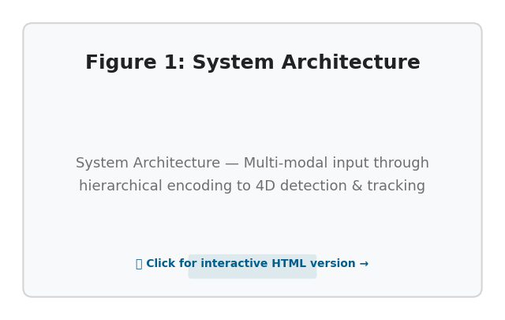](figures/fig_01.html) | [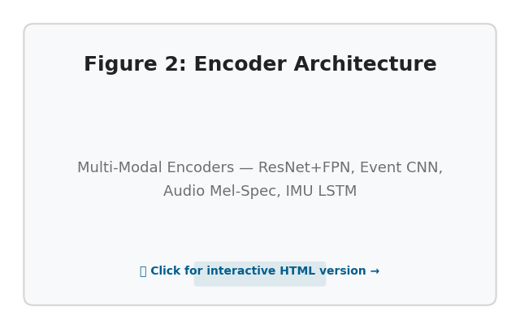](figures/fig_02.html) | [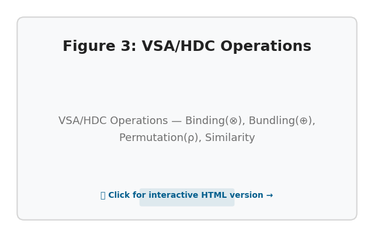](figures/fig_03.html) |
| **System Architecture** | **Encoder Architecture** | **VSA/HDC Operations** |
| [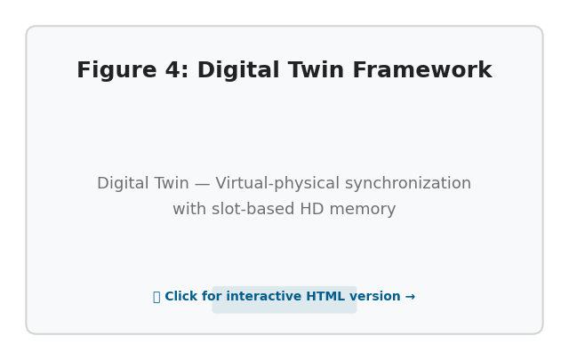](figures/fig_04.html) | [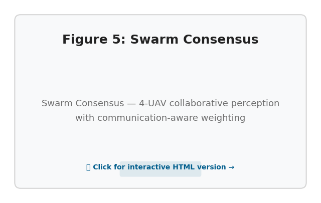](figures/fig_05.html) | [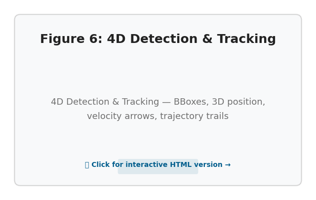](figures/fig_06.html) |
| **Digital Twin** | **Swarm Consensus** | **4D Detection & Tracking** |
| [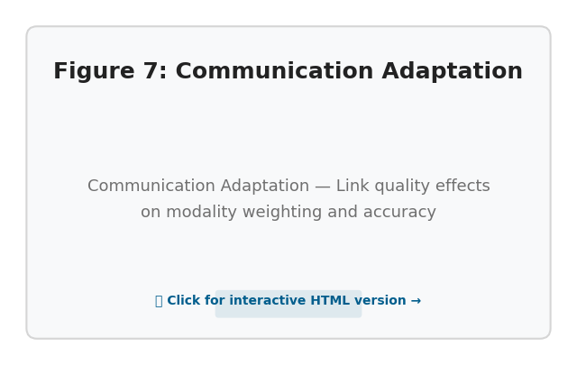](figures/fig_07.html) | [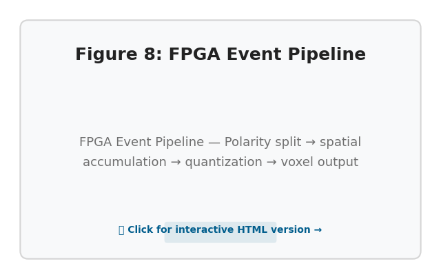](figures/fig_08.html) | [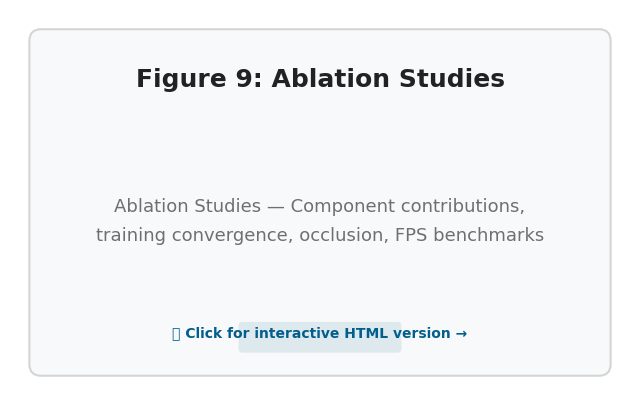](figures/fig_09.html) |
| **Communication Adaptation** | **FPGA Event Pipeline** | **Ablation Studies** |
| | [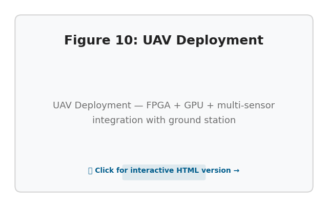](figures/fig_10.html) | |
| | **UAV Deployment** | |

> 🖱 Click any card to open the **interactive HTML figure** with SVG graphics, hover tooltips, and prev/next navigation.
> Also browse all figures at [`figures/index.html`](figures/index.html).

---

### Detailed Figure Descriptions

<details>
<summary>Click to expand — full descriptions of all 10 figures</summary>

#### Figure 1: Full Eldarin System Architecture

<p align="center">
  
</p>

#### Figure 2: Multi-Modal Encoder Architecture

<p align="center">
  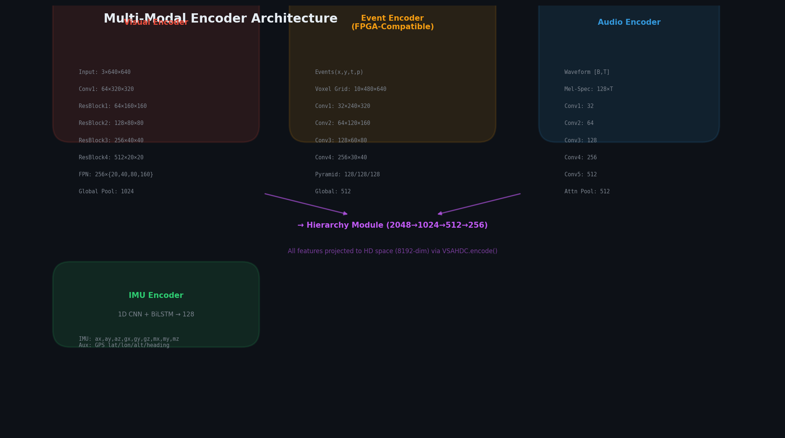
</p>

#### Figure 3: VSA/HDC Operations

<p align="center">
  
</p>

#### Figure 4: Digital Twin Framework

<p align="center">
  
</p>

#### Figure 5: Multi-UAV Swarm Consensus

<p align="center">
  
</p>

#### Figure 6: 4D Detection & Tracking

<p align="center">
  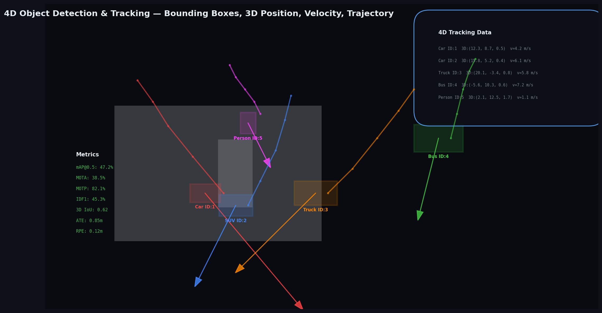
</p>

#### Figure 7: Communication-Aware Adaptation

<p align="center">
  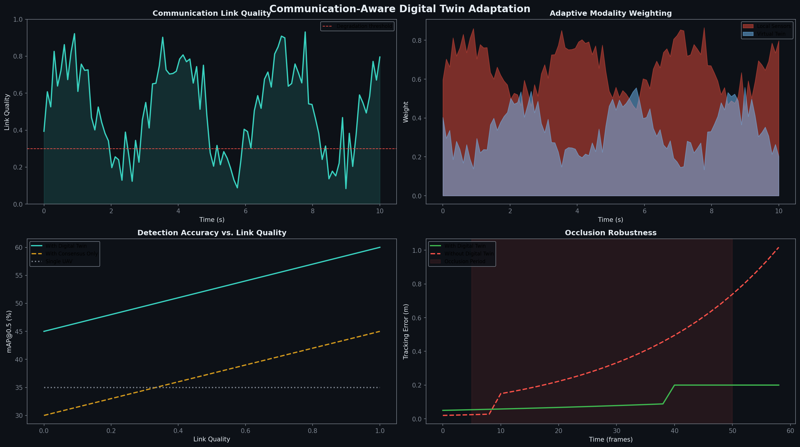
</p>

#### Figure 8: FPGA Event Stream Pipeline

<p align="center">
  
</p>

#### Figure 9: Ablation Studies

<p align="center">
  
</p>

#### Figure 10: UAV Hardware Deployment

<p align="center">
  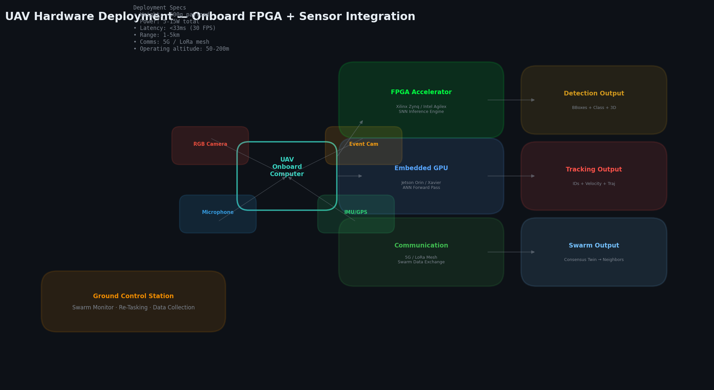
</p>

</details>

---

## Installation

```bash
# Clone the repository
git clone https://github.com/Enotrium/Eldarin.git
cd Eldarin

# Create conda environment (recommended)
conda create -n eldarin python=3.10
conda activate eldarin

# Install PyTorch (adjust for your CUDA version)
pip install torch torchvision torchaudio --index-url https://download.pytorch.org/whl/cu118

# Install core dependencies
pip install -r requirements.txt

# Optional: Install SNN framework for FPGA deployment
pip install snntorch lava-numpy  # or lava-dl for Intel Loihi

# Optional: Install event-camera tools
pip install tonic metavision-preview  # for event data processing
```

## Quick Start

### Inference (Real-time UAV)

```bash
python inference.py \
  --config config/inference.yaml \
  --checkpoint checkpoints/eldarin_v1.pth \
  --input /path/to/video.mp4 \
  --modality rgb+event \
  --output results/
```

### Training

```bash
# Single GPU training with VisDrone
python main.py \
  --config config/train_visdrone.yaml \
  --data_root /path/to/VisDrone \
  --epochs 100 \
  --batch_size 8

# Multi-GPU training
python -m torch.distributed.launch --nproc_per_node=4 main.py \
  --config config/train_multimodal.yaml \
  --distributed

# With event data (FRED dataset)
python main.py \
  --config config/train_event.yaml \
  --data_root /path/to/FRED \
  --modality rgb+event
```

### FPGA / SNN Export

```bash
# Convert to SNN for neuromorphic hardware
python fpga/convert_to_snn.py --checkpoint checkpoints/eldarin_v1.pth --output checkpoints/eldarin_snn.pth

# Export for FPGA HLS synthesis
python fpga/export_fpga.py --config config/fpga_export.yaml
```

## Supported Datasets

| Dataset | Modalities | Task | Link |
|---------|-----------|------|------|
| **VisDrone** | RGB | Detection + Tracking | [GitHub](https://github.com/VisDrone/VisDrone-Dataset) |
| **UAVDT** | RGB | Vehicle Detection/Tracking | [DatasetNinja](https://datasetninja.com/uavdt) |
| **UAV3D** | RGB + 3D Boxes | 3D Detection/Tracking | [Project Page](https://uav3d.github.io/) |
| **FRED** | RGB + Event | Drone Detection | [FRED](https://github.com/francesco-p/FRED) |
| **MVSEC** | Stereo + Event | Multi-vehicle | [MVSEC](https://daniilidis-group.github.io/mvsec/) |

## Metrics

Eldarin evaluates on standard UAV detection and tracking metrics:

- **Detection**: mAP@0.5, mAP@0.5:0.95, Precision, Recall
- **Tracking**: MOTA, MOTP, IDF1, HOTA, trajectory error (ATE, RPE)
- **4D-specific**: 3D IoU, velocity RMSE, occlusion robustness score

## Repository Structure

```
Eldarin/
├── README.md                    # This file
├── requirements.txt             # Python dependencies
├── main.py                      # Training entry point
├── inference.py                 # Real-time inference
├── config/
│   ├── __init__.py
│   ├── base.yaml                # Base configuration
│   ├── train_visdrone.yaml      # VisDrone training config
│   ├── train_multimodal.yaml    # Multi-modal training
│   ├── train_event.yaml         # Event-based training
│   ├── inference.yaml           # Inference configuration
│   └── fpga_export.yaml         # FPGA export settings
├── model/
│   ├── __init__.py
│   ├── eldarin_model.py         # Main Eldarin model
│   ├── encoders/
│   │   ├── __init__.py
│   │   ├── visual_encoder.py    # RGB frame encoder
│   │   ├── event_encoder.py     # Event stream encoder (FPGA-compatible)
│   │   ├── audio_encoder.py     # Audio encoder
│   │   └── imu_encoder.py       # IMU/auxiliary encoder
│   ├── hierarchy.py             # Hierarchy module (cascading fusion)
│   ├── mixing.py                # Bayesian-style mixing module
│   ├── vsa_hdc.py               # VSA/HDC operations (binding, bundling)
│   ├── heads.py                 # Detection + 4D tracking heads
│   ├── digital_twin.py          # Digital Twin + Swarm Consensus
│   └── snn_layers.py            # SNN-compatible layer definitions
├── utils/
│   ├── __init__.py
│   ├── data_loader.py           # Data loading utilities
│   ├── event_utils.py           # Event data processing (FPGA encode)
│   ├── metrics.py               # Detection + tracking metrics
│   ├── visualization.py         # Visualization tools
│   ├── loss.py                  # Loss functions
│   └── trainer.py               # Training loop utilities
├── datasets/
│   ├── __init__.py
│   ├── visdrone.py              # VisDrone dataset loader
│   ├── uavdt.py                 # UAVDT dataset loader
│   ├── uav3d.py                 # UAV3D dataset loader
│   ├── fred.py                  # FRED event dataset loader
│   └── synthetic.py             # Synthetic data generator
├── fpga/
│   ├── __init__.py
│   ├── convert_to_snn.py        # ANN → SNN conversion
│   ├── export_fpga.py           # FPGA HLS export
│   ├── event_encode.py          # FPGA event encoding (from Enotrium)
│   ├── hls_kernels/             # HLS C++ kernel templates
│   │   └── vsa_kernel.cpp
│   └── snn_sim.py               # SNN simulation harness
├── figures/                     # 10 interactive HTML figures
├── images/                      # 10 static PNG figures
├── scripts/
│   ├── download_datasets.sh     # Dataset download helper
│   ├── prepare_visdrone.py      # VisDrone preprocessing
│   ├── generate_figures.py      # PNG figure generator
│   ├── generate_figures_html.py # Interactive HTML figure generator
│   └── run_ablation.py          # Ablation study runner
└── checkpoints/                 # Model weights directory
```

## Key Architecture Features

### 1. Multi-Modal Fusion for 4D Tracking

Eldarin fuses RGB frames, event streams, audio, and IMU into a unified HD representation:

- **Inputs**: RGB frames + event streams + optional audio/IMU
- **Outputs**: Bounding boxes, class probabilities, 3D positions, velocities, trajectories
- **Head**: YOLO-style detection head + HD Kalman-inspired temporal filtering

### 2. Event-based Encoding (FPGA-Event-Based-encode Integration)

Leverages the efficient FPGA event encoding from [Enotrium/FPGA-Event-Based-encode](https://github.com/Enotrium/FPGA-Event-Based-encode):

- Sparse event-to-frame conversion optimized for FPGA streaming
- SNN-compatible spike representations
- Low-latency feature extraction suitable for real-time UAV processing

### 3. VSA/HDC Integration (arthedain-1)

Incorporates [arthedain-1](https://github.com/Enotrium/arthedain-1) VSA/HDC primitives:

- **Binding (⊗)**: Associates features across modalities (e.g., visual feature ⊗ event feature)
- **Bundling (⊕)**: Superimposes multiple feature bindings for compact representation
- **Permutation (ρ)**: Encodes temporal/sequential relationships for trajectory modeling
- **Similarity**: Cosine/hamming distance for robust matching under noise

These replace/supplement attention mechanisms with hyperdimensional operations that are:
- More robust to noise and sparsity
- Naturally compatible with binary/spike-based computation
- Hardware-efficient (bitwise operations on FPGAs)

### 4. Hierarchy Module Enhancement

The cascading high→low feature flow is augmented with VSA binding:
- High-level semantics (object class, scene context) bind with low-level features (edges, motion)
- Creates hyperdimensional "role-filler" representations
- Enables robust feature reconstruction under occlusion

### 5. Digital Twin & Swarm Consensus (Yan et al. 2026)

Multi-UAV collaborative perception with virtual-physical synchronization. Maintains a hyperdimensional digital replica of the physical world with slot-based memory, predictive forward model (`twin(t+1) ≈ ρ(twin(t))`), and consensus-based fusion across UAV swarms under communication constraints.

### 6. Mixing Module with Bayesian-HDC Updates

The Bayesian-style cross-modal updates operate in hyperdimensional space:
- Prior: HDC bundle of previous modalities
- Likelihood: HDC encoding of new modality
- Posterior: Weighted bundle with uncertainty gating
- Handles missing modalities (sparse sensor data) naturally

### 7. SNN Conversion Paths

For FPGA deployment:
- ANN layers → IF/LIF neuron equivalents
- Rate-based → temporal spike-based conversion
- Compatible with snnTorch and Lava frameworks
- HLS C++ kernel templates for direct FPGA synthesis

## Citations

If you use Eldarin in your research, please cite:

### Event-based Encoding
```bibtex
@software{enotrium_fpga_event_encode,
  title={FPGA-Event-Based-encode: Efficient FPGA Event Data Processing},
  author={Enotrium},
  url={https://github.com/Enotrium/FPGA-Event-Based-encode}
}
```

### VSA/HDC Framework
```bibtex
@software{enotrium_arthedain,
  title={arthedain-1: Vector Symbolic Architecture / Hyperdimensional Computing},
  author={Enotrium},
  url={https://github.com/Enotrium/arthedain-1}
}
```

### Digital Twin & Swarm Consensus
```bibtex
@article{yan2026digital,
  title={Digital twin-driven swarm of autonomous underwater vehicles for marine exploration},
  author={Yan, Jing and Zhang, Tianyi and Guan, Xinping and Yang, Xian and Chen, Cailian},
  journal={Communications Engineering}, volume={5}, number={1}, year={2026},
  publisher={Nature Publishing Group}, doi={10.1038/s44172-025-00571-7}
}
```

### Datasets
```bibtex
@inproceedings{zhu2021visdrone,
  title={VisDrone-DET2021: The Vision Meets Drone Object Detection Challenge Results},
  author={Zhu, Pengfei and others}, booktitle={ICCV Workshops}, year={2021}
}
@article{du2018uavdt,
  title={The Unmanned Aerial Vehicle Benchmark: Object Detection and Tracking},
  author={Du, Dawei and others}, journal={ECCV}, year={2018}
}
```

## License

MIT License. See [LICENSE](LICENSE) file.

## Contributing

Contributions welcome! Areas of particular interest:
- Additional dataset loaders
- SNN accuracy optimization
- FPGA deployment testing
- Multi-UAV collaborative tracking extensions

---

**Links**: [FPGA Event Encode](https://github.com/Enotrium/FPGA-Event-Based-encode) | [arthedain-1 VSA/HDC](https://github.com/Enotrium/arthedain-1) | [Yan et al. (2026)](https://www.nature.com/articles/s44172-025-00571-7)